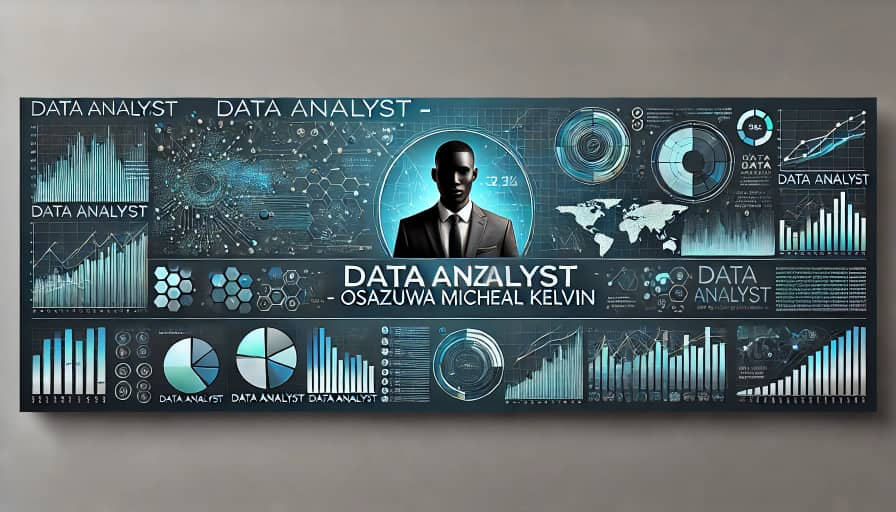
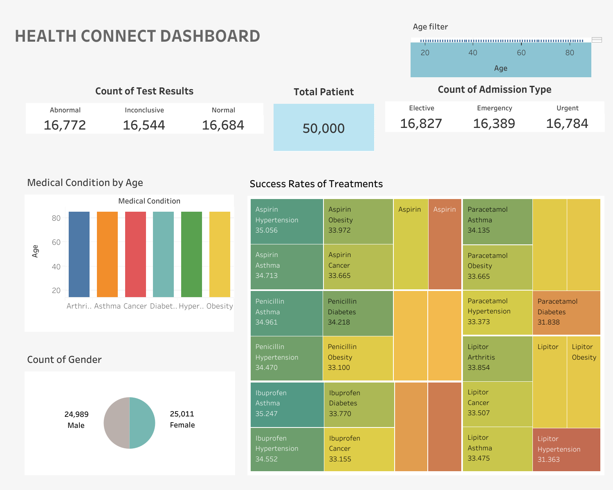
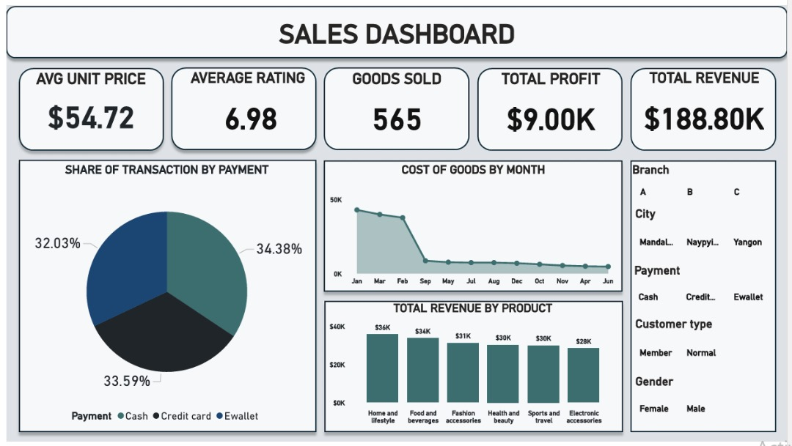
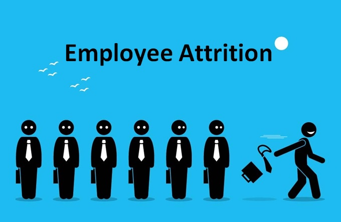
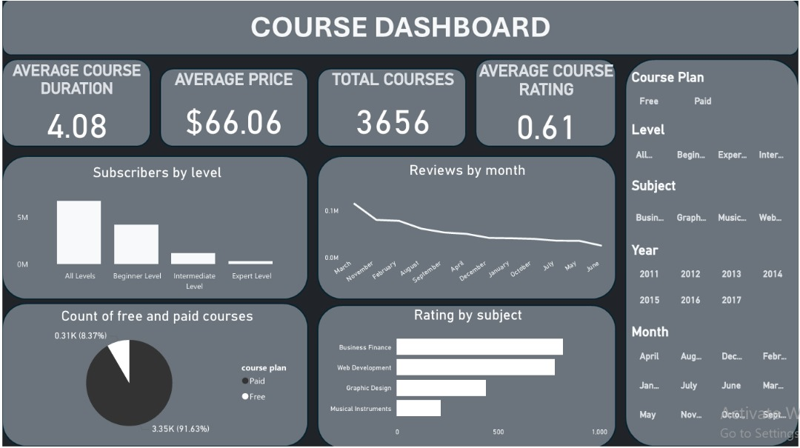

# Hi there, I'm Osazuwa Micheal Kelvin 👋

### About Me
I am a dedicated **Data Analyst** with expertise in transforming data into actionable business insights through **Excel**, **SQL**, **Power BI**, and **Python**. I excel at analyzing complex datasets, creating dynamic reports, and driving business strategy by connecting data with decision-making.

- 💼 Extensive experience working across diverse industries such as finance, retail, and logistics.
- 📊 Proficient in building dashboards, reports, and financial models that provide clarity on business performance.
- 🚀 Strong background in solving business problems with data-driven solutions.

### Skills & Tools
- **Data Analytics & Visualization**: Excel (Advanced), Power BI, Tableau.
- **Data Management**: SQL (MySQL, PostgreSQL).
- **Scripting & Automation**: Python (Pandas, NumPy, Matplotlib).
- **Business Intelligence**: Power BI for interactive dashboards and reporting.
- **Other Tools**: Microsoft Office Suite, Power Query, Power Pivot.

### Key Projects

### 1. [Healthconnect Data Analysis Project](https://github.com/Osazuwa-Micheal/healthconnect-analysis)

#### Overview  
This project involves analyzing a large healthcare dataset containing 50,000 anonymized patient records. The goal was to uncover insights and trends related to various health conditions, demographics, and outcomes to support data-driven healthcare decisions. 
- **Tools Used**: Tableau, Excel.

### 2. [Customer Rentention Project (Power BI)](https://github.com/Osazuwa-Micheal/sales-project)
- **Tools Used**: Power BI.
- **Objective**: Designed a Power BI dashboard to track and visualize key sales metrics (revenue, rating, and sales by city/product).
- **Outcome**: Enabled the sales team to quickly identify underperforming areas and adjust their strategies, increasing sales growth.

### 3. [HR Dashboard (Power BI)](https://github.com/Osazuwa-Micheal/sales-project)
- **Tools Used**: Power BI.
- **Objective**: Designed a Power BI dashboard to track and visualize key sales metrics (revenue, rating, and sales by city/product).
- **Outcome**: Enabled the sales team to quickly identify underperforming areas and adjust their strategies, increasing sales growth.

### 4. [Employee Attrition Analysis (Python)](https://github.com/Osazuwa-Micheal/employee-attrition)
- **Tools Used**: Python (numpy, Pandas, Matplotlib, seaborn, sklearn), Jupyter notebook.
- **Objective**: Determined what factor are most associated with employee attrition.
- **Outcome**: Identified three major factors  that lead to employees leaving a company, leading to improve retention of employee.

### 5. [Call Center Project (Power BI)](https://github.com/Osazuwa-Micheal/Call_Center_Project)
- **Tools Used**: Power BI.
- **Objective**: This project presents an interactive **Call Center Dashboard** built to analyze key performance metrics for customer service operations.
- **Outcome**:  The dashboard provides insights into customer satisfaction, call handling efficiency, agent performance, and overall call resolution rates.

### 6. [Sales Performance Dashboard (Power BI)](https://github.com/Osazuwa-Micheal/sales-project)
- **Tools Used**: Power BI, Excel.
- **Objective**: Designed a Power BI dashboard to track and visualize key sales metrics (revenue, rating, and sales by city/product).
- **Outcome**: Enabled the sales team to quickly identify underperforming areas and adjust their strategies, increasing sales growth.

### 7. [Course Sales Performance Dashboard (Power BI)](https://github.com/yourusername/financial-forecasting-model)
- **Tools Used**: Power BI, Excel.
- **Objective**: Designed a Power BI dashboard to track and visualize key course sales metrics (price, rating, and duration by level,subject,month and year.)
- **Outcome**: Enabled the sales team to quickly identify underperforming areas and adjust their strategies, increasing sales growth.

### My Workflow
- **Data Extraction**: Extracting and managing data using SQL from relational databases.
- **Data Analysis**: Using Python and Excel to clean, analyze, and manipulate datasets for business insights.
- **Data Visualization**: Crafting dynamic dashboards with **Power BI** to visualize key business metrics.
- **Reporting & Automation**: Automating repetitive tasks in **Excel** using Power Query and Power Pivot, streamlining business operations.

### Goals
- 🌱 Currently learning advanced **Data Science** and **Predictive Analytics** techniques to enhance forecasting models.
- 💡 Exploring more advanced uses of **Python** for data automation and integrating it into business workflows.

### Let's Connect
- 📫 Email: michealvolt01@gmail.com
- 💼 LinkedIn: [linkedin.com/in/osazuwa-kelvin](https://www.linkedin.com/in/micheal-osazuwa-kelvin14471230b)

I’m always open to collaborating on data-driven business solutions and innovative analytics projects 🚀
